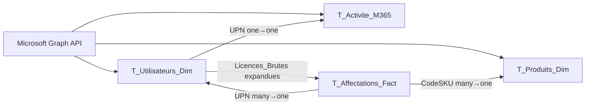

# Document de Passation — Dashboard M365
**Projet :** M365_UI  
**Date :** 2026-03-04  
**Dépôt Git :** `git@github.com:kafuicharbeleklu/M365.git`

> [!IMPORTANT]
> Base de travail active au 2026-03-23 :
> `M365_UI.pbip`
>
> La baseline validee `RECOVERY_UI_SAFE_V17` a ete exportee au root et le dossier recovery a ete nettoye.
>
> Les copies PBIP obsolètes du root et l'ancien checkpoint `RECOVERY_UI_SAFE_V13` ont été retirés pour conserver une seule base ouvrable.


---

## 1. Vue d'ensemble du projet

Dashboard Power BI connecté à **Microsoft Graph API** pour le suivi des licences Microsoft 365, de l'activité utilisateur et des indicateurs de sécurité d'un tenant Azure AD.

### Architecture du modèle



### Pages du rapport

| Page | Rôle | Sidebar | Accès |
|------|------|---------|-------|
| **P1 — Vue d'ensemble** | KPI globaux, graphiques adoption | ✅ | Menu latéral |
| **P2 — Analyse Licences** | Stock, affectations, risques | ✅ | Menu latéral |
| **P3 — Analyse Utilisateur** | Tableau résumé par utilisateur | ✅ | Menu latéral + Drillthrough source |
| **P4 — Détail Utilisateur** | Fiche détaillée d'un utilisateur | ❌ | Drillthrough uniquement |

---

## 2. Sources de données

| Table | API Endpoint | Authentification |
|-------|-------------|------------------|
| `T_Utilisateurs_Dim` | `GET /users?$select=...` | OAuth2 Client Credentials |
| `T_Activite_M365` | `GET /reports/getM365AppUserDetail(period='D180')` | idem |
| `T_Produits_Dim` | `GET /subscribedSkus` | idem |
| `T_Affectations_Fact` | Dérivée de `T_Utilisateurs_Dim.Licences_Brutes` | N/A (M query) |

**Paramètres d'authentification** (fichier `expressions.tmdl`) :
- `Param_TenantId`, `Param_ClientId`, `Param_Secret`

> [!CAUTION]
> Le `Param_Secret` est en clair dans le TMDL. En production, utiliser Azure Key Vault ou les paramètres chiffrés du service Power BI.

---

## 3. Colonnes calculées — Logique métier

### Statut AD
```dax
SWITCH(
    TRUE(),
    [AccountEnabled] = TRUE(),  "Activé",
    [AccountEnabled] = FALSE(), "Désactivé",
    "Non synchronisé"           -- AccountEnabled est NULL
)
```
**Valeurs attendues :** `Activé`, `Désactivé`, `Non synchronisé`

### TypeCompte
```dax
VAR Nom = LOWER(COALESCE([DisplayName], ""))
VAR Email = LOWER(COALESCE([UserPrincipalName], ""))
VAR _estVide = ISBLANK([DisplayName]) && ISBLANK([UserPrincipalName])
RETURN IF(_estVide, "Non defini", SWITCH(TRUE(), ...))
```
**Valeurs attendues :** `Utilisateur`, `Technique`, `Non défini`

### EtatActivite
Retourne `"Exclu"` pour les comptes techniques/désactivés (ancien comportement : `BLANK()`).  
**Valeurs attendues :** `Actif`, `Inactif (>90j)`, `Inactif M365`, `Jamais Connecté`, `Exclu`

---

## 4. Mesures clés

### Comptage de licences
```dax
LicencesAffectees = DISTINCTCOUNT(T_Affectations_Fact[AffectationID])
```

> [!IMPORTANT]
> **Ne jamais utiliser `COUNTROWS(T_Affectations_Fact)`** — la relation `CodeSKU → T_Produits_Dim` provoque un fanout qui double le comptage dans certains contextes de filtre.

### Mesures dérivées (héritent automatiquement du correctif)
| Mesure | Formule |
|--------|---------|
| `LicencesDisponibles` | `StockLicences - LicencesAffectees` |
| `LicencesActives` | `LicencesAffectees` filtrée sur `EtatActivite = "Actif"` via `TREATAS` |
| `LicencesInactives` | `LicencesAffectees - LicencesActives` |
| `TauxUtilisation` | `LicencesAffectees / StockLicences` |
| `TauxGaspillage` | `LicencesInactives / LicencesAffectees` |

---

## 5. Corrections appliquées durant cette session

### 5.1 Intégrité des données

| # | Problème | Cause | Correction |
|---|----------|-------|------------|
| 1 | `(Blank)` dans filtres Statut AD | `IF()` ne gère pas `AccountEnabled = NULL` | `SWITCH(TRUE())` avec 3 cas |
| 2 | `(Blank)` dans TypeCompte | `LOWER(NULL)` provoque erreur CONTAINSSTRING | `COALESCE` + garde `_estVide` |
| 3 | `(Blank)` dans EtatActivite | `BLANK()` retourné intentionnellement | Remplacé par `"Exclu"` |
| 4 | Licences x2 dans les KPI | `COUNTROWS` sensible au cross-filter fanout | `DISTINCTCOUNT(AffectationID)` |
| 5 | 24 lignes par utilisateur dans P3 | Colonne `T_Affectations_Fact[NomProduit]` dans le tableau | Remplacée par mesure `[LicencesAffectees]` |

### 5.2 Mise en page (grille 1920×1080)

| # | Correction |
|---|------------|
| 6 | Grid system uniforme appliqué aux 4 pages |
| 7 | En-têtes standardisés : y=8, h=72, bottom=80 |
| 8 | Bandeaux filtres/MAJ superposés en transparent dans la zone titre |
| 9 | Contenu P2/P3 remonté de 36px, tables étendues |
| 10 | Sidebar P3 alignée sur P1/P2 (hauteurs slicers harmonisées) |
| 11 | Action cards P3 réduites à 380px |

### 5.3 Typographie (échelle unifiée)

| Niveau | Élément | Taille |
|--------|---------|--------|
| T1 | Titres de page | **20pt** bold |
| T2 | Sous-titres | **11pt** |
| T3 | Valeurs KPI | **24D** |
| T4 | Titres KPI / Sections | **13D** |
| T5 | En-têtes tableau | **12D** |
| T5b | Données tableau | **11D** |
| T6 | Boutons / Bandeaux / Labels | **12pt / 12D** |

---

## 6. Architecture des pages — Structure visuelle

### Template commun (toutes pages sauf P4)
```
┌──────────┬──────────────────────────────────────────┐
│          │  Titre (20pt)         Filtres | MAJ (12D) │  y=8, h=72
│ Sidebar  ├──────────────────────────────────────────┤  y=80
│ w=280    │                                          │  y=92 → contenu
│          │   KPI Cards (13D/24D)                    │
│ - Logo   │                                          │
│ - Nav    │   Tableaux / Graphiques (12D/11D)        │
│ - Slicers│                                          │
│          │                                          │
└──────────┴──────────────────────────────────────────┘
                        1920px
```

### P4 — Détail Utilisateur (sans sidebar)
```
┌──────────────────────────────────────────────────────┐
│  ← Retour    Titre (20pt)                            │  y=8, h=72
├──────────────────────────────────────────────────────┤  y=92
│  Cards info (Nom, Email, Dept, Statut, État)         │
│  KPI (Licences Affectées, Actives, Inactives)        │
│  Profil (Niveau, Score, Apps, Dates)                 │
│  Tableau détail licences (CodeSKU, NomProduit, ...)  │
└──────────────────────────────────────────────────────┘
             Centré dans 1680px (marge x=120)
```

---

## 7. Points de vigilance pour la maintenance

### Relations
- ✅ Toutes les relations sont **unidirectionnelles** — ne jamais activer le cross-filter bidirectionnel
- La relation `T_Utilisateurs_Dim.UPN → T_Activite_M365.UPN` est one-to-one, pas one-to-many

### Ajout de nouvelles mesures
- Toujours utiliser `DISTINCTCOUNT` ou `CALCULATE` avec filtres explicites
- Ne **jamais** utiliser `COUNTROWS(T_Affectations_Fact)` directement
- Tester les nouvelles mesures dans un contexte avec ET sans filtre T_Produits_Dim

### Ajout de colonnes dans les tableaux
- **P3 (résumé)** : n'utiliser que des colonnes de `T_Utilisateurs_Dim` ou des mesures
- **P4 (détail)** : seule page autorisée à utiliser des colonnes de `T_Affectations_Fact`
- Ajouter une colonne de `T_Affectations_Fact` dans un tableau qui contient déjà `T_Utilisateurs_Dim` **crée une ligne par licence par utilisateur**

### Valeurs blanches dans les filtres
- Si un nouveau champ génère des `(Blank)`, vérifier la colonne source dans la M query
- Appliquer `COALESCE` ou `SWITCH` avec un cas par défaut — ne jamais laisser un `IF()` sans branche "null"

---

## 8. Fichiers modifiés (récapitulatif)

### Modèle sémantique
| Fichier | Modifications |
|---------|--------------|
| `tables/T_Utilisateurs_Dim.tmdl` | Statut AD (SWITCH), TypeCompte (COALESCE), EtatActivite (Exclu) |
| `tables/_Mesures.tmdl` | LicencesAffectees (DISTINCTCOUNT) |

### Rapport (layout/visuals)
| Dossier | Modifications |
|---------|--------------|
| `pages/a4497031bb.../visuals/` | P1 : typographie, boutons 12pt |
| `pages/54f9d470ac.../visuals/` | P2 : banners overlay, KPI recalés, table étendue |
| `pages/3c4cbe0b28.../visuals/` | P3 : banners overlay, tableau corrigé, sidebar alignée, action cards |
| `pages/page_drillthrough.../visuals/` | P4 : titre standardisé, contenu centré |

---

## 9. Commandes utiles

```bash
# Vérifier les modifications
git diff --stat

# Voir les changements d'un fichier spécifique
git diff -- "M365_UI.SemanticModel/definition/tables/_Mesures.tmdl"

# Commit des corrections
git add -A && git commit -m "fix: audit complet DAX, layout, typographie, cohérence données"

# Push
git push origin main
```
